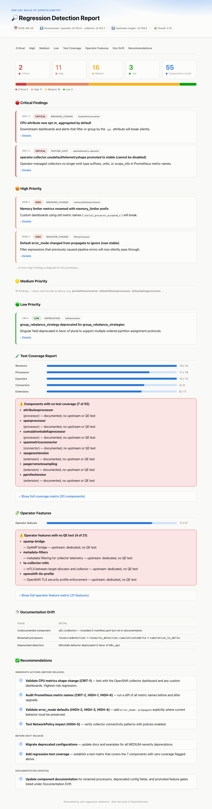

# Regression Detection

Automated system that detects upstream regressions in OpenTelemetry repos compared to the currently shipped Red Hat build of OpenTelemetry release. It dynamically discovers components from `konflux-opentelemetry` (manifest.yaml, submodule pins, release branch) — no manual config updates are needed for new releases.

## What it detects

| Method | What it finds |
|--------|---------------|
| Changelog analysis | Breaking changes, deprecations, behavior changes in CHANGELOG.md |
| Code diff analysis | Removed/renamed config fields, changed defaults, new required fields |
| Feature gate tracking | Gates promoted Alpha→Beta→Stable→Removed that change defaults |
| GitHub issue/PR scanning | Bugs, regressions, reverted PRs via `gh` CLI |
| Doc validation | Stale docs (field removed upstream), undocumented new fields |
| Test coverage matrix | Per-component AND per-operator-feature coverage report (dedicated/implicit/none) |
| Dependency tracking | Significant version bumps in go.mod |

## Run locally

Before running locally, check the latest [CI run](../../actions/workflows/regression-detection.yml) — if the report is recent enough, download the artifact instead to save tokens.

```
# Full regression detection
/otel-regression-detection

# Single detection method (faster, lower cost)
/otel-regression-detection --method changelog

# Analyze a specific release version (uses v3.10 tag in konflux-opentelemetry)
/otel-regression-detection --release-version 3.10
```

## Run in CI

The GitHub Actions workflow (`.github/workflows/regression-detection.yml`) checks weekly for new upstream operator releases and runs automatically when a new release is detected. It invokes the same skill headlessly:

```bash
claude -p "/otel-regression-detection --method changelog" \
  --dangerously-skip-permissions \
  --output-format text \
  --allowedTools "Bash,Read,Write,Edit,Workflow,Agent" \
  --max-budget-usd 25
```

It can also be triggered manually via the **Run workflow** button on the [Actions page](../../actions/workflows/regression-detection.yml).

## Cost controls

- **Budget cap**: $25 per run (enforced via `--max-budget-usd 25`)
- **CI schedule**: runs only when a new upstream release is detected (checked weekly)
- **Single-method runs**: use `--method <name>` for targeted, lower-cost checks
- **Check CI first**: download the latest CI artifact before running locally

## Output

Reports are written to `reports/`:
- `regression-report-YYYY-MM-DD.html` — self-contained HTML report with findings by severity (open in a browser)
- `regression-summary-YYYY-MM-DD.json` — machine-readable summary counts

Example output:



## How it stays current

Everything is derived at runtime from `konflux-opentelemetry`:

| What | Source |
|------|--------|
| Component list | `redhat-opentelemetry-collector/manifest.yaml` |
| Collector base version | `manifest.yaml` → `dist.version` |
| Operator base commit | `git submodule status` |
| Release branch | `.gitmodules` |
| Downstream version | `bundle-patch/patch_csv.yaml` |
| Doc coverage | Glob `openshift-docs/otel-collector/modules/*.adoc` |

When `konflux-opentelemetry` is updated for a new release, regression detection automatically picks up the changes.
