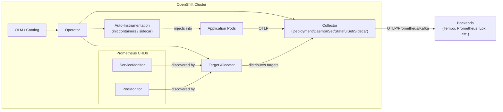
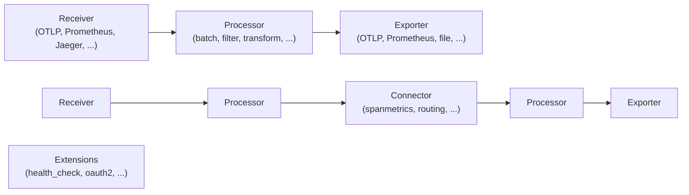
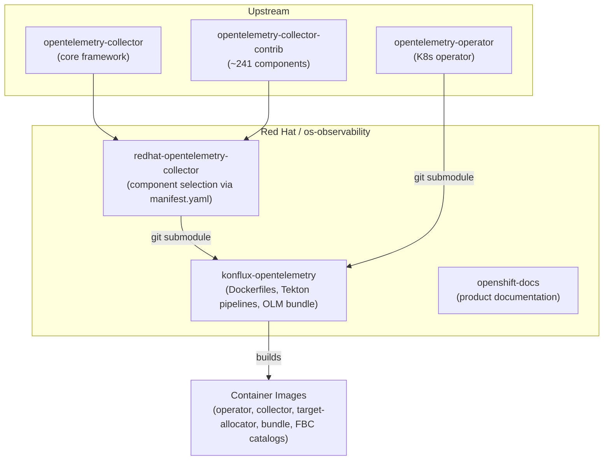

# Architecture

Red Hat build of OpenTelemetry (RHOSDT) is an OpenTelemetry distribution for OpenShift. It provides a supported, FIPS-compliant telemetry pipeline for collecting traces, metrics, and logs from applications and infrastructure.

## System Overview

The product consists of three runtime components deployed on OpenShift via OLM:

- **Operator** — manages the lifecycle of collectors, auto-instrumentation, and target allocators
- **Collector** — a vendor-agnostic telemetry pipeline that receives, processes, and exports telemetry data
- **Target Allocator** — distributes Prometheus scrape targets across collector instances

## Collector Pipeline

The collector uses a pipeline architecture where data flows through configurable components:

The Red Hat distro includes ~54 components selected from upstream core and contrib (~300+ available).

## Repository Structure

## Build Pipeline

1. **Component selection**: `manifest.yaml` in `redhat-opentelemetry-collector` declares which upstream components to include
2. **Code generation**: OpenTelemetry Collector Builder (OCB) generates Go source into `_build/`
3. **Container build**: Konflux/Tekton pipelines build multi-arch (amd64, arm64, ppc64le, s390x) UBI9-based images with FIPS-compliant crypto
4. **Bundle packaging**: upstream OLM bundle is patched with Red Hat metadata via `patch_csv.py`
5. **Catalog generation**: per-OpenShift-version File-Based Catalogs (FBC) for OLM channel resolution

## Key Architectural Decisions

**Declarative component selection**: The Red Hat distro does not fork the collector. Instead, `manifest.yaml` declaratively selects components, and OCB generates the binary. This minimizes divergence from upstream.

**Fork-based workflow**: All contributions go through personal forks, not direct pushes to origin. Squash before merging.

**FIPS compliance**: All Go binaries use `strictfipsruntime` build tags. A post-build FIPS check verifies no non-FIPS crypto functions are linked.

**Multi-version OCP support**: FBC catalogs are generated per OpenShift version (4.12–4.22), allowing version-specific operator compatibility.
